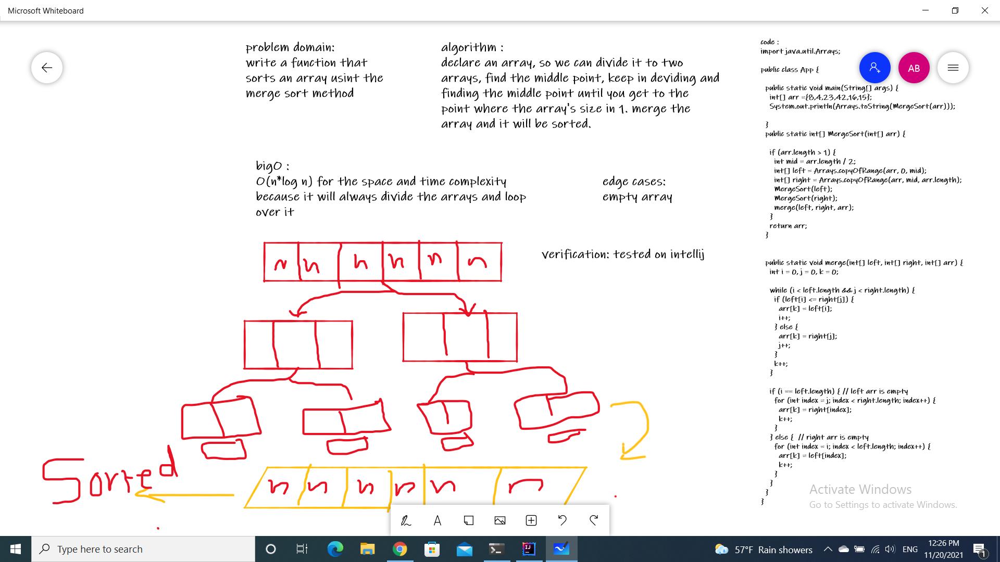

# Merge Sort

**Merge sort** is an algorithm that sorts an array by dividing the array into to halves. do the work in the two halves seperately and then merge them together.

# The PseudoCode:

``` java
ALGORITHM Mergesort(arr)
    DECLARE n <-- arr.length

    if n > 1
      DECLARE mid <-- n/2
      DECLARE left <-- arr[0...mid]
      DECLARE right <-- arr[mid...n]
      // sort the left side
      Mergesort(left)
      // sort the right side
      Mergesort(right)
      // merge the sorted left and right sides together
      Merge(left, right, arr)

ALGORITHM Merge(left, right, arr)
    DECLARE i <-- 0
    DECLARE j <-- 0
    DECLARE k <-- 0

    while i < left.length && j < right.length
        if left[i] <= right[j]
            arr[k] <-- left[i]
            i <-- i + 1
        else
            arr[k] <-- right[j]
            j <-- j + 1

        k <-- k + 1

    if i = left.length
       set remaining entries in arr to remaining values in right
    else
       set remaining entries in arr to remaining values in left
```

# Trace :
Sample Array: [8,4,23,42,16,15]

step one:
the array will be divided into two halves based on the number of elements, if the array had 6 elements it will divide each 3 on a separate array.
now we will have two arrays Left & Right.

ps:  this photo is from geeksforgeeks.

step two:

the process will continue, so each array will be divided into two arrays until there is no way to divide it, which means that the number of indexes is 1 now.
step three:
when we get to the point where there is only two in each array, we will compare between them (left & right) so we can get the smaller number.

step four:
the merge processes come into action and start merging arrays back till the complete array is merged.

now the merged array will be sorted.


1. Space Complexity :
O(n log n)

2. Time Complexity:
O(n*log n)
because in all cases it will be devideing the array and looping over it.
# important note:
to run the app:
- go to build.gradle
- run the test from there.
the white board :
  
