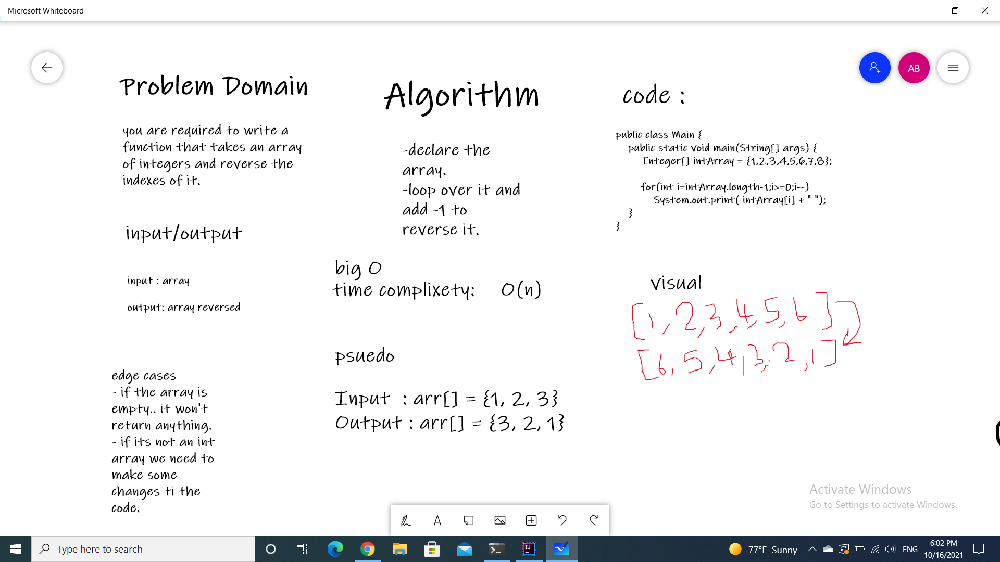

# binary search of an Array
I am required to write a function that takes an array of integers and returns it an reversed order.

## Approach & Efficiency

it took 1 hours to solve this code challenge.>>>>>