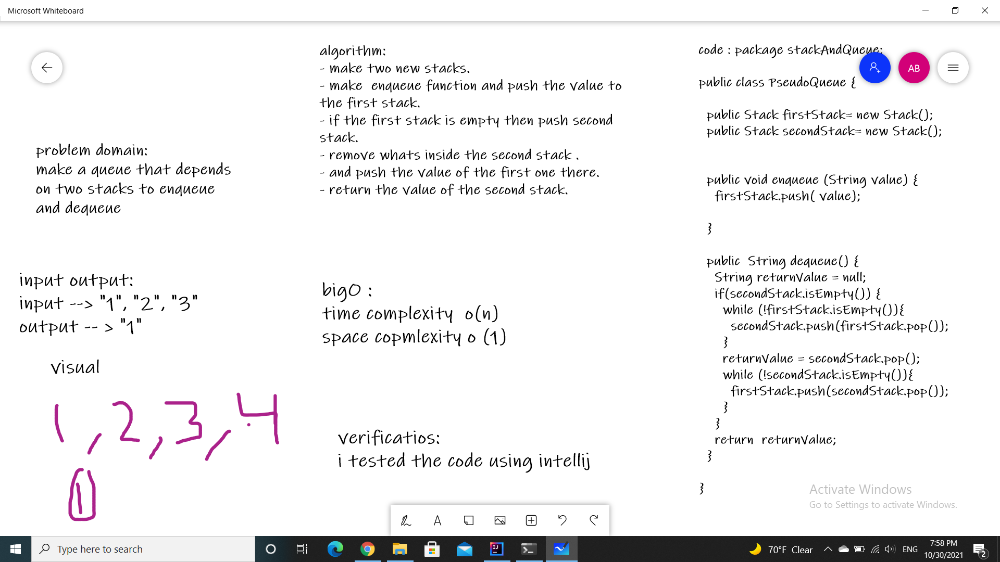

# Stacks and Queues
<!-- Short summary or background information -->
Stack and Queue are data structures that follows a particular order for adding or removing elements. Linear data structures organize their components in a straight line
## Challenge
<!-- Description of the challenge -->
I am required to write a code that (add and remove) (push and pop on the stack case), and (enqueue and dequeue in Queue case) and also make test to make sure that everything is working
## Approach & Efficiency
<!-- What approach did you take? Why? What is the Big O space/time for this approach? -->
I created an 3 classes one for the node and one for the queueu and pne for the stack and I started creating functions for each one of the required strategies.
the bigO is big o(1 )

To test use ./gradle test in the terminal.
## API
<!-- Description of each method publicly available to your Stack and Queue-->
no API's

## code challenge 11 :
I am required to make a queue using two stacks so we can add to the first node in the queue.

